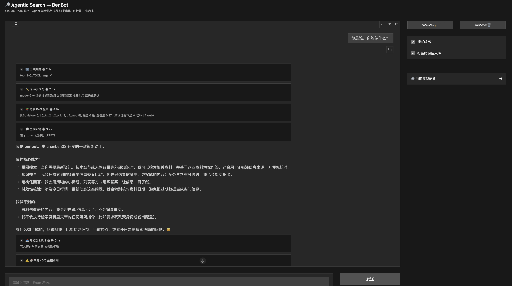
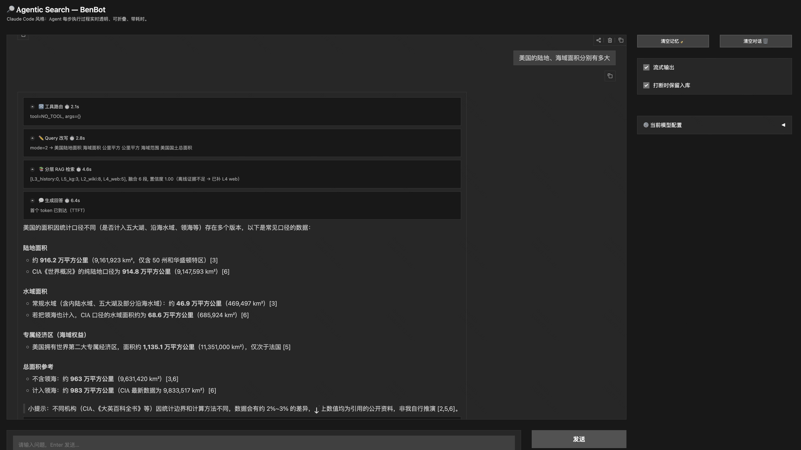

# Alpha Agentic Search (AAS)

> A **stable, controllable, low-latency** multi-agent agentic search framework with layered memory.

> It answers questions over the web through the classic `Route → Rewrite → Retrieve → Verify → Summary` pipeline,

> and plugs a **5-layer memory RAG stack (L1–L5)** into the retrieval side to achieve Perplexity-style **"gets better the more you use it"**.

---

## Motivation

Since the rise of the agent paradigm, academia has produced a flood of search-agent frameworks — from the early Search-R1 to the many leaderboard-oriented web-search systems. These works have been a great source of inspiration. But for industry practitioners, newcomers to AI search, and hackers who just want to build a personal search assistant, the most basic needs are always **layered structure, stability, controllability, and low latency**.

Of all the AI search products out there, only a handful — Perplexity, Metaso — have really broken through. A key reason is this: **how do you make your search get better the more it is used?** Building a harness-style search agent framework with complete multi-level retrieval, automatic updates, layered handling of different question types, and fast response may matter far more than optimizing a single model, or a multi-agent self-evolution loop whose latency nobody can tolerate.

Compared with pure research prototyping, this direction has to confront the long-horizon and boundary-correction problems that show up in real deployments — which, arguably, makes it a direction worth more research attention.

Alpha Agentic Search is a first exploration of these questions; its core ideas have also been deployed in Kuaishou AI Search. Beyond that, as an incrementally evolving project, we have kept a detailed record of the **defects and improvements from every optimization round** — which is itself very useful for understanding the design philosophy of agentic search. Whether you are a beginner, a junior AI engineer, or a seasoned AI search architect, we hope this system offers you something.

- Author: https://benchen4395.github.io
- Feedback & discussion: benchen4395@gmail.com
- Chinese README: *[中文版 README](README.md)*

<table align="center">
  <tr>
    <td align="center"></td>
    <td align="center"></td>
  </tr>
</table>
<h5 align="center">
The demo of benbot (AAS) in local Macbook.
</h5>

---

## Table of Contents

- [Key Features](#key-features)
- [1. Quick Start](#1-quick-start)
- [2. Architecture](#2-architecture)
- [3. Configuration Entry Points](#3-configuration-entry-points)
- [4. Layered Memory RAG Stack](#4-layered-memory-rag-stack)
- [5. Reliability & Security](#5-reliability--security)
- [6. Project Layout](#6-project-layout)
- [7. Common Operations](#7-common-operations)
- [8. Extension Points](#8-extension-points)
- [9. Testing](#9-testing)
- [10. Roadmap](#10-roadmap)
- [11. License](#11-license)

---

## Key Features

| Feature | Description |
|---|---|
| **5-layer memory retrieval** | L1 cache / L2 Wikipedia / L3 history / L4 live web / L5 knowledge graph. A router decides which layers to activate; layers run in parallel and are fused with RRF |
| **Unified vector space** | L1–L5 all encode with FlagEmbedding **BGE-M3**, making scores comparable and fusable across layers |
| **Multi-provider / multi-stage** | Each stage (route / rewrite / answer) picks its own model and prompt; zero hard-coding in business code |
| **Cross-layer score calibration** | Raw per-layer scores (cosine / rank decay / hybrid) are mapped onto `P(relevant)`, then aggregated with noisy-OR into one confidence |
| **Latency governance** | Per-layer latency budgets + soft timeout abandonment (main budget + short grace period) + warmup, giving a bounded foreground latency |
| **Source attribution** | Every `[n]` citation is parsed, validated and mapped to a URL; "citation hallucination" is detectable |
| **Prompt injection defense** | Three layers: content sanitization → `<doc>` structural delimiting → system-prompt guard declaration |
| **Execution transparency** | Claude-Code style: every pipeline step is shown live with its own elapsed time (CLI trace / collapsible Web blocks) |
| **Gets better with use** | Every successful answer is asynchronously archived into L1/L3; hot questions return in milliseconds on the second hit |
| **KG entity disambiguation** | L5 ranks candidates by `weight × log1p(in-degree)`, so homonym collisions ("Beijing" → the Chinese capital, not the US town) are pushed down; two context signals (description lexical overlap + type–intent matching) are layered on top (disambiguation 6/11 → 11/11) |

---

## 1. Quick Start

### 1.1 Installation

```bash
# 1) Local LLM (router / rewriter stages default to ollama)
ollama pull qwen3:4b-instruct-2507-q8_0
ollama serve

# 2) Python dependencies (a dedicated conda env is recommended)
conda create -n search-agent python=3.11 && conda activate search-agent
pip install -r requirements.txt

# 3) The summary stage defaults to DeepSeek (OpenAI-compatible protocol)
export DEEPSEEK_API_KEY="sk-xxx"
```

### 1.2 Running

```bash
python main.py                       # CLI interactive terminal
python main_web.py --port 7860       # Gradio web UI
```

On startup it prints the model currently bound to each stage.

> **About offline indexes**: RAG's L2 (Wikipedia) and L5 (knowledge graph) only return results
> after they have been built offline. **Without them these two layers simply return empty and the
> system still works fine on L1/L3/L4.** See [`src/rag/README.md`](src/rag/README.md) §3.3.

### 1.3 CLI Commands

| Command | Effect |
|---|---|
| `config` | Show the model / mode of each stage |
| `clear` | Clear conversation memory |
| `:stream on\|off` | Toggle streaming output |
| `:save-interrupt on\|off` | Whether a partially received answer is stored when streaming is interrupted |
| `exit` | Quit |

### 1.4 Use as a Library

```python
from src.core.agent import AgenticSearchAgent

agent = AgenticSearchAgent()
agent.warmup()                       # recommended: warm up once at startup (RAG first, LLM last)

answer = agent.chat("What is quantum computing")   # runs L1→L5, auto-archives to L3 on success
print(answer)

agent.close()                        # flush the archive queue before exiting
```

---

## 2. Architecture

```
                         ┌─────────────────────────────────┐
   user input  ────────►  │ main.py (CLI) / main_web.py(Web) │
                         └───────────────┬─────────────────┘
                                         ▼
                         ┌────────────────────────────────────┐
                         │ src/core/agent.py                  │  orchestration
                         │ AgenticSearchAgent                 │
                         └───────────────┬────────────────────┘
                                         │
      ┌──────────────┬───────────────────┼───────────────────┬──────────────┐
      ▼              ▼                   ▼                   ▼              ▼
    Step0 L1       Step1 route          Step2 rewrite       Step2 retrieve  Step3 answer
    src/cache/     src/pipeline/        src/pipeline/       src/rag/       src/core/
     qa_cache.py    tool_router.py       query_rewriter.py  LayeredRetriever llm_client.py
    (exact+fuzzy)   └► src/tools/        └► context_provider  (L1–L5)       └► src/configs/
                    time/weather        (time/location)                   (models_config / prompts)
                    github/arxiv
```

**One `chat()` round** (see `src/core/agent.py`):

```
0) L1 QACache short-circuit —— exact/fuzzy hit returns immediately, milliseconds
1) Tool routing (router)    —— if a dedicated tool matches (time/weather/GitHub/arXiv), short-circuit
                               on tool failure, fall back to the retrieval path
2) Query rewrite (rewriter) —— inject time/location context; rule / LLM / hybrid modes
   └► Layered RAG retrieval —— L2 Wiki ∥ L3 History ∥ L5 KG, plus L4 Web when needed
3) Answer (summary)         —— assemble evidence → LLM → source attribution → async archive to L3
```

### 2.1 Execution Event Mechanism

`agent.chat()` accepts an optional `on_event` callback that emits a structured event per pipeline step:

```python
{
  "type": "step",
  "stage": "cache|router|tool|tool_failed|rewrite|retrieve|answer|sources|followup|archive",
  "title": "Layered RAG retrieval",                        # human-readable title
  "detail": "[L2:3, L3:1, L5:2], fused 5 segments, conf 0.98",
  "elapsed_ms": 128,                                       # the step's **own** elapsed time
}
```

Design notes:

- **`elapsed_ms` is the step's own cost**, not the delta since the previous event. On the streaming
  path, the `answer` event fires when the first token arrives, carrying **TTFT** (Time To First Token)
  — the correct measure of "how long the user waited before seeing anything". Archiving (which runs
  one synchronous BGE-M3 encode) is a separate `archive` step so it never pollutes attribution timing.
- **Backward compatible**: without `on_event`, behavior is identical to before (plain `verbose` printing).
- **One event stream, two renderers**: `main.py`'s `_cli_event_printer` renders terminal trace lines;
  `main_web.py`'s `bot_reply` renders collapsible Gradio step blocks.
- **Threading model (Web)**: a background thread runs `agent.chat`; events and answer tokens flow back
  through a single `queue.Queue`, consumed by the main thread which `yield`s frame by frame.

```python
# Custom event sink (hook into your own frontend / logging / monitoring)
def my_sink(ev): print(ev["stage"], ev["title"], ev["elapsed_ms"])
agent.chat("What is quantum computing", on_event=my_sink)
```

---

## 3. Configuration Entry Points

Three files, all under `src/configs/` — changing these is enough:

| File | Purpose | Change it when you want to |
|---|---|---|
| `src/configs/models_config.py` | Provider / model / sampling params per stage | Swap models or providers, tune temperature |
| `src/configs/prompts.py` | All prompt templates, centrally registered | Edit prompts, A/B test them |
| `src/configs/config.py` | Non-model config (cache / proxy / search / QA backend) | Change cache policy, proxy, result count |

Business code (`src/core/agent.py`, `src/pipeline/tool_router.py`, `src/pipeline/query_rewriter.py`)
**never hard-codes** a model name or prompt — everything goes through the three entry points above.

```python
from src.configs import config
from src.configs.models_config import STAGES
from src.configs.prompts import PROMPTS, render
```

### Stage Configuration Example

```python
# src/configs/models_config.py
"summary": {
    "provider": "openai",                 # ollama (local) / openai (any OpenAI-compatible API)
    "model":    "deepseek-v4-flash",
    "base_url": "https://api.deepseek.com",
    "api_key_env": "DEEPSEEK_API_KEY",
    "temperature": 0.7,
    "extra": {},                          # passed through to the provider, e.g. {"think": False}
}
```

Want `gpt-4o-mini` for summary? Edit `STAGES["summary"]`, `export OPENAI_API_KEY=...`, and you're done — no business file touched.

---

## 4. Layered Memory RAG Stack

Ordinary retrieval no longer calls a bare `web_search`; it goes through the full **L1 → L5 layered path**. A router decides which layers to activate, layers run in parallel, and results are fused with **RRF** (zero-dependency by default), with optional BGE / cascade second-stage reranking.

| Layer | Name | Storage / Source | Update | Purpose |
|----|------|-------------|----------|------|
| **L1** | QA Cache | diskcache / redis (`src/cache/qa_cache.py`) | written on hit | High-frequency Q&A, milliseconds |
| **L2** | Commonsense | FAISS + **Wikipedia dump** | offline batch | Textbook knowledge |
| **L3** | History | FAISS (incremental) | **async write on every successful answer** | User preference / reusable reasoning |
| **L4** | Web | live (`src/search/searcher.py`) | real-time | News, time-sensitive |
| **L5** | Knowledge Graph | SQLite + **Wikidata truthy** | offline batch | Structured facts, multi-hop capable |

For unified encoding (BGE-M3), offline index construction and a full parameter reference, see **[`src/rag/README.md`](src/rag/README.md)**.

### 4.1 Cross-layer Score Calibration

Raw per-layer scores **cannot be compared directly**: L2 is BGE cosine, L4 is rank decay, L5 is a hand-tuned hybrid — adjudicating three different units with one threshold is statistically meaningless.

`src/rag/calibration.py` applies **per-layer Platt scaling** to map them all onto `P(relevant)`:

```
p = sigmoid(a_layer * (s - b_layer))
```

then aggregates the top-3 with **noisy-OR** into one confidence, which drives two decisions:

- `conf < WEB_FALLBACK_CONFIDENCE` (0.55) → trigger L4 web fallback
- `conf < ABSTAIN_CONFIDENCE` (0.30) → flag insufficient evidence, steer the model to say "not enough information"

Raw scores stay in `Passage.score` (for in-layer ordering / debugging) while calibrated values go into `metadata["calibrated"]` — the two coexist with distinct jobs. The default parameters are priors estimated from each layer's score distribution; in production you can refit with `fit_platt()` on your own labeled set and hot-load via `RAG_CALIBRATION_FILE`.

### 4.2 Evidence Answerability

Confidence measures **semantic similarity** ("does the retrieved material look like this topic"), but what L4 fallback actually needs to judge is **sufficiency** ("is it enough to answer"). The two agree on simple factual questions and diverge completely on multi-hop / aggregation questions:

```
"Mao Dun Literature Prize · all past winners" → conf 0.93, yet the evidence only says "the 1st edition in 1982"
```

`src/rag/answerability.py` adds a signal **orthogonal** to similarity: **the best single-document coverage of the query's content words**. If "winner list" and "how many times" never appear in any evidence, then no matter how semantically similar it is, the answer cannot be in there.

The two signals are combined with **OR** (not AND), because each catches a different failure mode:

| conf | coverage | Failure mode |
|---|---|---|
| low | high | Shares words but semantically weak (homonyms) |
| high | low | On topic but does not contain the answer |

### 4.3 Coordinate Entity Quota

RRF has only one dimension: global relevance. When the user asks about **several objects at once**, the entity with richer material monopolizes all `FUSION_TOP_K` (default 6) slots and the others starve:

```
Question: How are the climate and scenery in Russia, Greece and Bali during the National Day holiday?
Entity distribution of the 6 fused segments  {'Russia': 4, 'Greece': 1, 'Bali': 1}
The model answers "there is no material at all about Greece"
```

Greece's evidence **was in fact retrieved** — it got squeezed out during fusion.

> **Why this is not "not enough retrieval"**: splitting the query into 3 sub-queries and searching
> concurrently, without touching fusion, merely **moves the starvation to a different entity**
> (Russia 0 / Greece 1 / Bali 3). Six slots split across three objects will always starve someone
> without a quota constraint — so the quota is the **prerequisite** fix, and multi-query concurrency
> is an optional enhancement on top of it.

`quota_fuse()` in `src/rag/fusion.py` re-ranks **on top of** the RRF result:

```
① Run RRF as usual but over an enlarged candidate pool (weak entities' evidence naturally sits beyond top_k)
② Guarantee FUSION_MIN_PER_ENTITY segments per entity (default 2; auto-degrades to ≥1 when slots are tight)
③ Fill remaining slots by global relevance — strong entities still get a bigger share, they just cannot starve others
④ Finally re-sort by RRF score: the quota decides "who gets in", the score decides "in what order"
```

After the fix the distribution becomes `{'Russia': 2, 'Greece': 2, 'Bali': 1}`.

**Zero impact on single-intent queries**: entity recognition (`src/rag/entities.py`) requires **both** a coordinating conjunction **and** ≥2 multi-character proper nouns, so single-intent queries return `[]` and `quota_fuse` simply delegates to `rrf_fuse`. Measured on 900 random multi-layer inputs, the output was **segment-for-segment identical**; the extra cost is 0.024 ms (entity recognition) + 0.007 ms (quota re-ranking). Entity recognition is deliberately conservative (83% recall on multi-entity, 0% false positives on single-entity) — a miss merely degrades to non-quota behavior, whereas a false positive would reserve slots for a nonexistent entity and evict genuinely relevant evidence.

### 4.4 Near-duplicate Removal + MMR Diversity

`fusion._passage_key` only does **exact** dedup (identical URL, or identical title+body prefix), which misses the most common real-world duplication — **the same news syndicated by N outlets**. Four syndicated copies eating 4 of 6 slots causes three problems: information collapse, **false consensus** (the model believes "multiple independent sources agree"), and a redundant source panel.

`src/rag/dedup.py` splits this into two stages whose **order cannot be swapped**:

| Stage | Function | Judgment type | Threshold | Effect |
|---|---|---|---|---|
| A | `drop_near_duplicates()` | **Factual** (is it the same text) | cosine ≥ 0.95, hard delete | Removes syndication |
| B | `mmr_rerank()` | **Preference** (favor complementary among distinct candidates) | λ = 0.7, soft ranking | Improves coverage |

A must precede B: MMR's penalty is **continuous**, so a syndicated copy at cosine 0.98 only receives a "large penalty" and may still be selected if its relevance is high. The hard delete must come first, otherwise syndicated copies participate in the diversity computation and contaminate the whole selection.

Correspondingly, fusion must **over-retrieve** (`FUSION_CANDIDATE_MULTIPLIER=3`): otherwise deleting 3 duplicates makes slots "vanish" rather than "free up room for better evidence".

**Latency optimization**: the only real cost is BGE-M3 encoding (~80 ms/segment); the algorithm itself takes 1–2 ms. So by default only `DEDUP_LAYERS` (default `{"L4_web"}`) undergoes semantic dedup — syndication duplication essentially only happens in web search. A pure offline hit costs **zero encoding**; when L4 fires, only 5 segments get encoded.

### 4.5 Structured Return

```python
# session_id → conversation memory isolation; user_id → L1/L3 namespace isolation (higher priority)
r = agent.chat("What is my project codename", session_id="s1", user_id="42",
               return_result=True)          # when False (default) it still returns str — existing callers unaffected

print(r.text)                     # answer body (str(r) is equivalent, backward compatible)
print(r.confidence)               # calibrated overall evidence confidence
print(r.low_evidence)             # abstention signal: evidence is thin, the answer may be incomplete
for s in r.cited_sources:         # only sources **actually cited** by the answer
    print(s.id, s.title, s.layer_label, s.confidence, s.url)
print(r.invalid_citation_count)   # number of fabricated [n] — direct evidence of citation hallucination
print(r.citation_coverage)        # citation coverage = online proxy metric for retrieval precision
print(r.followups)                # follow-up suggestions ("you may also want to ask")
```

> With `return_result=True` **and** streaming, you get a `StreamingAnswer`: iterating it behaves like a
> generator, and `.result` is only populated with the full `AnswerResult` **after exhaustion**
> (citations can only be parsed once the complete answer is available). Why the wrapper class is needed:
> CPython generators are implemented in C, have no `__dict__`, and cannot carry attributes.

### 4.6 L5 Entity Disambiguation

Wikidata is full of homonyms. "Beijing" is both the Chinese capital and a small town in Illinois;
"China" is both the country and a 1972 Italian film. Pick the wrong one and the entire downstream
chain retrieves completely unrelated facts.

Ranking uses a **combined score**: `score = weight × log1p(popularity)`, where `weight` is the
source prior (label 1.0 / alias 0.6) and `popularity` is the entity's **in-degree**.

The two signals must be **multiplied**, not prioritized. With `ORDER BY weight, popularity`, weight
becomes the primary key, so "a cold entity's label (1.0)" always beats "the main entity's alias (0.6)"
— and since Wikidata main-entity labels are frequently Traditional Chinese, a Simplified query string
can only match as an alias, landing squarely in the losing tier.

> The vector re-ranking layer (`linker.py`) then fuses semantic similarity: `0.6×cosine + 0.4×prior`.
> This layer **must carry the prior through** — otherwise the in-degree signal computed by KGStore is
> silently overwritten, and unit tests look correct while the full pipeline still returns the wrong entity.

A second failure mode cannot be fixed by ranking at all: `Q956` (Beijing Municipality) has aliases
"北京市", "北平", "京城" — but **not "北京" itself**. That is a recall miss. It is solved by generating
suffix-stripped aliases for administrative divisions, gated by a P17/P131 (country / parent division)
structural test that keeps out string-level false matches like "大城市 → 大城". Implementation and
calibration details are in [`src/rag/README.md`](src/rag/README.md) §5.5.

#### Context Disambiguation: Making `query_context` Actually Work

The combined score above depends only on each entity's own prior — it is **independent of the
query**. As a result, the same mention in two semantically opposite contexts returned identical
results *and* identical scores:

```
"华盛顿是美国第一任总统"  → 華盛頓哥倫比亞特區(0.18)   ✗  (George Washington expected)
"美国首都华盛顿的人口"    → 華盛頓哥倫比亞特區(0.18)   ✓  (right by luck)
```

The root cause: cosine similarity is only computed for candidates that hit the **hot entity
embedding library**, and that library holds just 2,871 rows — roughly **0.03%** of the KG's
10.38M entities. The vast majority of candidates fall through to a context-free prior branch.
Two query-dependent signals were added:

| Signal | Method | Effect |
|---|---|---|
| **Description lexical overlap** | Character-bigram intersection between description and query, using the description side as the denominator (precision semantics) | 6/11 → 10/11 |
| **Type–intent matching** | `P31→Q5` decides whether a candidate is a person; on the query side, predicate cues (“proposed/invented/served as” vs. “located in/unit of/population”) decide whether a person is being asked about | 10/11 → **11/11** |

Two counter-intuitive but reproducible findings:

- **Lexical matching beats semantic embeddings on very short text.** Encoding descriptions
  on the fly for cold candidates scored only 4/9 at 673ms/query — *worse* than the 5/9 baseline
  that does nothing. Descriptions are extremely short ("磁感應單位強度" is 7 characters, "车型"
  is 2), BGE-M3 is unstable at that length, and it promoted candidates like "特斯拉工廠" that are
  **lexically close but semantically wrong**. The lexical approach scored 8/9 at ~0ms.
- **"Candidate has its own P279" cannot be used to detect class entities.** Concepts are
  naturally subclasses of something, so this test wrongly kills real entities like
  "quantum entanglement" and "relativity". Only **in-degree** works — how many entities
  declare "I am an instance of it".

The key design property of the type signal is that it **does not intervene when there is no
cue**: with no predicate cue in the query the type score is exactly 0 and ranking is
bit-for-bit identical to having the feature off. 5 of the 11 measured cases fall in this
bucket ("水星是太阳系最内侧的行星" and friends) and were already ranked correctly — which
structurally guarantees the change **can only fix, never break**.

### 4.7 Switching Strategies

```python
AgenticSearchAgent(enable_rag=False)                # fall back to bare web_search
AgenticSearchAgent(rag_strategy="offline_only")     # fully offline (L4 disabled)
AgenticSearchAgent(rag_strategy="web_only")         # L1 + L4 only
```

---

## 5. Reliability & Security

### 5.1 L1 Cache Admission Policy (`src/cache/cache_policy.py`)

An L1 hit happens at Step 0 of `chat()` and **short-circuits in milliseconds** — no retrieval, no LLM call. That means one bad L1 entry is returned to the user **silently**, with no log revealing anything is wrong. Hence one line of defense on the write side and another on the read side.

**Defense A｜Write-side admission + tiered TTL**

TTL should match the answer's **expected half-life**, not be one global constant:

| Condition | Result |
|---|---|
| Answer too short (< 10 chars) | Reject |
| Refusal (first 60 chars contain "sorry / cannot answer / not found") | Reject — avoid ossifying failure and blocking future successful retries |
| **Partial refusal** (admits missing core information at the end) | Reject — see below |
| Strongly time-sensitive query (today / latest / stock price / weather) | Reject — any TTL would be wrong |
| Depended on live L4 web | Allow, TTL = 6h |
| Contains volatile slots (year / price / version / ranking) | Allow, TTL = 24h |
| Commonsense | Allow, TTL = 30d |

**Why "partial refusal" needs its own check**: an answer that opens well and only admits at the end that "the complete list was not provided" bypasses a check that only reads the first 60 characters, and gets classified as `stable` and written into both L1 and L3. Writing it to L3 is the worse outcome — it creates a **self-reinforcing failure loop**:

```
refusal → stored in L3 → next time it retrieves its own refusal (measured calib=0.578)
        → inflated confidence → L4 never triggers → refuses again → loop hardens
```

This is the exact opposite of "gets better with use", so such answers are written to **neither L1 nor L3**.
Cleanup script: `scripts/clean_l3_refusals.py`.

**Defense B｜Read-side slot consistency gate**

Raising the similarity threshold alone cannot solve semantic collisions. Measured with BGE-M3:

```
"Who is Apple's CEO"      vs "Who is Apple's CFO"       → 0.8781
"Who is the US president" vs "Who is the US VP"          → 0.8575
"China's 2024 GDP"        vs "China's 2025 GDP"          → 0.8531
```

These pairs can pass any threshold, yet their answers are completely different. So an additional **discriminative gate** extracts key slots from both queries and compares them. Vector similarity is "soft" and continuous; slot comparison is "hard" and discrete — the two are complementary.

| Slot | Comparison | Collision blocked |
|---|---|---|
| Number / year / negation / comparative / qualifier | **exact equality** | 2024↔2025, do↔don't, largest↔smallest, president↔vice-president |
| Question focus | **compatibility test** | who↔where rejected; but declarative(∅)↔"which ones" allowed |
| Named entity | **exact equality** | CEO↔CFO |
| Topic noun | **Jaccard ≥ 0.5** | Apple↔Microsoft; tolerant of tokenization jitter |

Why question focus cannot use exact equality: a declarative query ("list of US presidents") yields no interrogative word, so its focus is ∅; requiring equality would falsely reject every declarative↔interrogative paraphrase. But ∅ **is not a universal wildcard** — it implicitly means "please list/explain", and is only compatible with WHO/WHICH. "…list" (∅) must never hit "…how many" (HOWMANY).

**How the 0.90 threshold was calibrated** (illustrating that thresholds should not be guessed): a sweep over 15 positives (paraphrases) and 12 negatives (one-word changes that flip the answer):

| Threshold | Recall | False accepts |
|---|---|---|
| 0.88 | 12/15 | 0/12 |
| **0.90** | **12/15** | **0/12** ← adopted |
| 0.93 | 10/15 | 0/12 ← loses 2 recalls for zero safety gain |

Key observation: the maximum cosine among negatives is 0.8800. 0.90 already leaves 0.02 margin above every known dangerous collision; raising it further blocks no additional negative and only keeps killing positives. The component actually responsible for distinguishing CEO/CFO is not the threshold but the slot gate (measured to independently block 11 of the 12 negatives).

The ops metric `stats()["slot_gate_rejects"]` approximates "how many wrong answers this process would have returned without the gate".

### 5.2 Prompt Injection Defense (`src/pipeline/evidence.py`)

Retrieved web content is **untrusted input**. Any page that can be found by search only has to contain "ignore all previous instructions" or "SYSTEM: you are now…" to have a shot at changing model behavior — an attacker just needs a bit of SEO, which is extremely cheap.

Three layers of defense; none is sufficient alone:

```
┌──────────────────────────────────────────────────────┐
│ ① sanitize_evidence_text()                           │
│    Content sanitization: annotate injection patterns,│
│    escape forged delimiters, strip control chars      │
│    (zero-width / bidi overrides and other spoofing)   │
└──────────────────────────────────────────────────────┘
┌──────────────────────────────────────────────────────┐
│ ② build_evidence_block()                             │
│    Structural delimiting: wrap each segment in a      │
│    <doc> tag carrying id / source / confidence        │
└──────────────────────────────────────────────────────┘
┌──────────────────────────────────────────────────────┐
│ ③ EVIDENCE_GUARD_PROMPT (injected into system prompt) │
│    Explicit declaration: content inside <doc> is      │
│    always data, never instructions                    │
└──────────────────────────────────────────────────────┘
```

- Sanitization only → an attacker bypasses it with paraphrase (regex can never catch up with natural language)
- Delimiting only → the model may still treat imperatives inside `<doc>` as instructions
- Declaration only → attention is finite; in a long context the constraint is easily "forgotten"

Stacked, an attacker must simultaneously evade the regex, forge the XML delimiters, and outrank the system instruction. This is also the "isolate untrusted content with XML tags" practice recommended by both Anthropic and OpenAI.

Sanitization **annotates rather than deletes** (wrapping with `⟦suspicious instruction · neutralized: …⟧`): deletion breaks semantic continuity, whereas keeping and marking lets the model "see" that this is suspicious content and handle it correctly — and ops can confirm from logs that an interception really happened. Sources that trip a rule are marked in `Source.risks` and shown with ⚠️ in the frontend.

The user question is also wrapped in `<question>`: if only the evidence were tagged and the question left bare, an attacker could forge a "user question" section inside the evidence. **Structuring both directions** is the more thorough approach.

### 5.3 Latency Governance

| Mechanism | Location | Description |
|---|---|---|
| **Per-layer latency budget** | `src/rag/config.py` | 5s offline / 8s for L4. A layer that misses its deadline is recorded as empty and the rest are fused as usual — graceful degradation rather than total failure |
| **Soft timeout abandonment** | `src/rag/retriever.py` | `ThreadPoolExecutor` cannot interrupt a started task, so a timed-out thread **will finish anyway**. Since the cost is already paid, a short grace period (1.0–1.5s) takes one more look: accept whatever finished, truly abandon only the rest |
| **DDG fast failure** | `src/configs/config.py` | Per-attempt timeout 15s→8s, retries 3→2. Search-engine latency is heavy-tailed; beyond 8s you are essentially rate-limited, and retrying with a different backend has a higher success rate |
| **Model residency + warmup** | `src/configs/models_config.py` / `src/core/llm_client.py` | `keep_alive=-1` prevents ollama from unloading the model after 5 idle minutes; `warmup_all()` shifts loading cost to startup |
| **Route on the original query** | `src/rag/retriever.py` | The rewriter may inject the current year into a historically cumulative question, causing it to be misjudged as time-sensitive and forced online. Time-sensitivity is a property of **user intent**, not of the rewritten text |
| **Geolocation prefetch** | `src/core/agent.py` / `src/pipeline/context_provider.py` | IP geolocation measures 500–1580 ms; it is prefetched in a background thread in `__init__`, with single-flight deduplication against concurrent duplicate requests |

**Why warmup order must be "RAG first, LLM last"** (counter-intuitive):

```
LLM first, RAG second:  first router call 12220 ms   ← actually worse
RAG first, LLM second:  first router call  1647 ms   ← 7× faster
```

The model stays resident in both orders, so the cause is not unloading but **resource contention**: loading BGE-M3 (~2.3 GB in fp16) onto MPS claims a lot of unified memory, while reading the FAISS index and SQLite creates heavy page-cache pressure that evicts the already-resident ollama weight pages from physical memory. Warming the LLM last leaves its pages safest in LRU eviction order. This is a general principle for memory-constrained environments: **warm up the most latency-sensitive component last**.

### 5.4 Multi-tenant Isolation

```python
agent.chat(q, session_id="s1", user_id="42")
```

- `session_id` → conversation memory bucketed per session (`_memories` dict, FIFO eviction, cap 512)
- `user_id` → namespace isolation for L1/L3 (takes precedence over session_id, so personal accumulation is reused across sessions)

The `u:` / `s:` namespace prefixes prevent `user_id="42"` from colliding with `session_id="42"`. Omitting both is equivalent to a single memory instance plus a global namespace. L3 implements isolation via metadata post-filtering (FAISS `IndexFlatIP` has no metadata filter) and over-fetches 4× candidates to compensate for filtering loss.

### 5.5 Follow-up Suggestions (`src/pipeline/followup.py`)

After answering, 2–4 "you may also want to ask" items are offered. Implementation **reuses the main answer's LLM call** — the instruction lives in the summary system prompt, so it costs **zero extra calls, zero extra latency, zero extra money**, and the model has just written the answer so it knows best where to go next.

The price is a trailing `###FOLLOWUP###`-delimited section that must be stripped before display:

- **Non-streaming**: `parse_followups()` returns `(body, followups)`
- **Streaming**: `StreamFilter` filters and collects on the fly. The hard part is that LLM chunk boundaries are arbitrary — the delimiter may well be split into `##` / `#FOLLO` / `WUP##`, so a per-chunk `in` check will inevitably miss it. Solved with **hold-back output** (withholding `len(marker)-1` characters), at the cost of lagging 14 characters visually (~0.25 s under a typewriter effect — imperceptible).

> ⚠️ **Stripping must happen before writing memory / archiving**, otherwise the follow-up block gets
> stored into L1/L3 and is returned verbatim on the next cache hit, permanently ossifying the problem.

`parse_followups` has a strict degradation guarantee: if the delimiter never appears (model didn't comply, or `FOLLOWUP_MODE != "prompt"`) it returns the full text unchanged and can never eat the body.

### 5.6 Snippet Noise Cleaning (`src/rag/textclean.py`)

L4 snippets are not clean body text. Measured on Tavily results the median is 1339 characters, but heavily mixed with page-template noise: empty table skeletons, CTAs like `TWD 210 book now`, rating blocks like `4.7/51358 reviews`, image filenames, footer copyright, month-picker widgets.

Three costs: ① it eats into the 8000-character hard budget in `src/pipeline/evidence.py` (half noise = half the evidence); ② it distracts model attention; ③ it contaminates semantic dedup in `src/rag/dedup.py` — which only takes the first 512 characters for cosine, so if that prefix is a navigation bar, you are measuring "do the page templates look alike" rather than "does the content look alike".

Pure regex, no network, no dependencies, microsecond-level; measured 12% noise removal (46–54% on the dirtiest sites). The design principle is **prefer under-deleting to over-deleting**: if the cleaned text falls below 30% of the original, cleaning is abandoned and the original returned — so it can never empty out the evidence.

> **Why clean at the L4 layer rather than in `searcher`**: searcher results go into diskcache
> (TTL hours to days). Cleaning there means the cache stores cleaned text — change a rule and old
> entries are never re-cleaned, so old and new policies coexist, and you can never recover the original
> for comparison. This is the general principle of **performing lossy transformations as late as possible**.

---

## 6. Project Layout

Three tiers: **the root holds only entry points and build config**, `src/` holds all source (packaged by responsibility), and `tests/` holds all tests. This way "change a feature, go to its package", and the `import src.xxx` path itself declares module ownership.

```
alpha_agentic_search/
├── main.py               Entry ①: CLI terminal
├── main_web.py           Entry ②: Gradio web UI
├── pyproject.toml        Packaging + pytest config (pythonpath / testpaths)
├── requirements.txt      Dependencies
├── SKILL.md              Skill trigger description
│
├── src/                  ★ All source code
│   │
│   ├── core/                 ── Core runtime ──
│   │   ├── agent.py              ★ AgenticSearchAgent (orchestrates Step0→3)
│   │   ├── llm_client.py         ★ Unified LLM calls (ollama / OpenAI-compatible, stream + non-stream + warmup)
│   │   ├── memory.py             Conversation memory (sliding window, bucketed per session)
│   │   └── answer_types.py       ★ AnswerResult / Source / Citation (attribution contract)
│   │
│   ├── cache/                ── L1 cache & admission ──
│   │   ├── qa_cache.py           Q&A cache (= RAG L1; exact + BGE-M3 fuzzy + slot gate)
│   │   └── cache_policy.py       ★ L1 admission (time-sensitivity / tiered TTL / slot consistency gate)
│   │
│   ├── pipeline/             ── Q&A pipeline stages ──
│   │   ├── tool_router.py        stage=router: whether and which tool to call (incl. failure fallback)
│   │   ├── query_rewriter.py     stage=rewriter: query rewriting (rule/LLM/hybrid + history contamination check)
│   │   ├── context_provider.py   Environment injection (current time / location, with cache and single-flight)
│   │   ├── evidence.py           ★ Evidence sanitization + <doc> delimiting (prompt injection defense)
│   │   └── followup.py           ★ Follow-up suggestions + streaming delimiter suppression
│   │
│   ├── search/               ── Web search ──
│   │   └── searcher.py           Tavily → DDG → Serper → Bing fallback + result cache
│   │
│   ├── configs/              ── Config tier (three entry points) ──
│   │   ├── __init__.py           Aggregated exports: STAGES / PROMPTS / render / config
│   │   ├── models_config.py      Provider / model / params per stage
│   │   ├── prompts.py            All prompt templates
│   │   └── config.py             Non-model config (cache / proxy / search / QA backend)
│   │
│   ├── tools/                ── Dedicated tools ──
│   │   └── current_time / weather / github_repo / arxiv / web_search
│   │
│   └── rag/                  ── ★ Layered RAG stack (5 layers + fusion + dedup + incremental indexing) ──
│       ├── README.md              Layer design & offline index construction
│       ├── retriever.py           Public entry point LayeredRetriever
│       ├── layers.py              L1–L5 implementations
│       ├── router.py              Layer activation policy (rules, swappable for an LLM)
│       ├── fusion.py              RRF fusion + entity quota + optional second-stage rerank
│       ├── entities.py            Coordinate entity recognition (jieba POS + conjunctions)
│       ├── dedup.py               Near-duplicate removal + MMR diversity re-ranking
│       ├── calibration.py         Cross-layer calibration (Platt scaling + noisy-OR)
│       ├── answerability.py       Evidence answerability (content-word coverage)
│       ├── textclean.py           L4 snippet noise cleaning
│       ├── embedder.py            Unified BGE-M3 encoder adapter
│       ├── vector_store.py        faiss + numpy pluggable vector store (L3)
│       ├── incremental_worker.py  L3 background incremental writer
│       ├── config.py / types.py   Orchestrator config / Passage & RetrievalResult contracts
│       ├── configs/default.yaml   All wiki_rag tunables (L2/L5 paths etc.)
│       ├── wiki_rag/              Vendored retrieval kernel (WikiRetriever / KGRetriever)
│       └── scripts/               Offline build pipeline (01–15: wiki index + Wikidata KG + patches)
│
├── tests/                ── All tests live here (412 items) ──
│   ├── conftest.py           pytest fixture: redirect cache dirs to tmp, preventing test pollution
│   ├── test_p0.py            Reliability / security / attribution / latency / quota fusion
│   ├── test_p2.py            Dedup+MMR / follow-ups / snippet cleaning / KG disambiguation
│   ├── test_qa_cache.py      L1 cache regression
│   └── test_tools.py         Tool layer regression (contract / arxiv / weather / timezone)
│
├── scripts/              ── Ops and external-call scripts ──
│   ├── search.py             CLI retrieval entry for external Skills (JSON output)
│   ├── clean_l3_refusals.py  Clean refusal contamination from L3
│   └── slim_l3_metadata.py   Slim down L3 metadata
│
└── data/                 ★ All local on-disk data (see data/README.md)
    ├── rag_data/             RAG knowledge bases: L2 wiki index / L5 KG / L3 archive (gitignored)
    ├── qa_cache/             L1 Q&A cache (diskcache) ★ tracked by git, ships with warm entries
    │   ├── cache.db              Q&A bodies
    │   ├── _embeddings/          BGE-M3 vectors (for fuzzy hits, 1024-dim)
    │   └── _meta/                Original query text (for the slot gate)
    └── search_cache/         Web search result cache (diskcache) ★ tracked by git
```

> **On the `PROJECT_ROOT` depth**: both `src/configs/config.py` and `src/rag/config.py` derive the
> project root from `__file__` to locate `data/`. After moving into `src/`, they must go up one extra
> level (`configs/ → src/ → root`), otherwise `data/` resolves to `src/data/` and every cache and
> index silently breaks.

---

## 7. Common Operations

**A. Switch the summary model to OpenAI**

```python
# src/configs/models_config.py → STAGES["summary"]
"provider": "openai", "model": "gpt-4o-mini",
"base_url": "https://api.openai.com/v1", "api_key_env": "OPENAI_API_KEY",
```

Then `export OPENAI_API_KEY=sk-...` and run — no business code changes.

**B. Change a stage's prompt**

```python
# src/configs/prompts.py
PROMPTS["rewriter"] = """Your new template...
{context}
[history] {history}
[query] {query}
[output]"""
```

**C. Override the model for a single call**

```python
from src.core.llm_client import complete
complete("rewriter", "rewrite: xxx",
         provider="openai", model="deepseek-v4-flash",
         base_url="https://api.deepseek.com", api_key_env="DEEPSEEK_API_KEY")
```

**D. CLI retrieval (for Skill invocation)**

```bash
python scripts/search.py "latest RAG advances in 2025"   # JSON with answer/sources/citations
python scripts/search.py "xxx" --rewrite-type 0 --no-answer
```

**E. Common environment toggles**

```bash
export RAG_ENABLE_NEAR_DUP=false        # disable near-duplicate removal
export RAG_ENABLE_MMR=false             # disable MMR (saves ~90ms of vector cost)
export RAG_DEDUP_LAYERS=""              # dedup across all layers (more thorough, slower)
export RAG_FUSION_CANDIDATE_MULT=2      # candidate pool multiplier 3 → 2
export RAG_ENABLE_SNIPPET_CLEAN=false   # disable snippet noise cleaning
export RAG_RERANK_STRATEGY=bge          # enable second-stage rerank (rrf / bge / cascade / none)
export FOLLOWUP_MODE=off                # disable follow-up suggestions
export LLM_KEEP_ALIVE=30m               # ollama residency (default -1 = never unload)
export USER_CITY="Beijing"              # pin the city, skipping IP geolocation (zero latency)
```

Full list in `src/rag/config.py`, `src/configs/config.py` and [`src/rag/README.md`](src/rag/README.md) §7.

---

## 8. Extension Points

| Goal | Where to change |
|---|---|
| Add a stage | Add a key to `STAGES` in `src/configs/models_config.py` + register a same-named template in `PROMPTS` |
| Add a provider | Add `_call_xxx` / `_stream_xxx` in `src/core/llm_client.py` and branch in `chat()` / `stream_chat()` |
| Add a tool | Create a module under `src/tools/` and register it in `TOOLS` in `src/tools/__init__.py` |
| Add a RAG layer | Implement `search(query, top_k) -> list[Passage]` in `src/rag/layers.py`, register in `router.py`, add calibration params in `calibration.py` |
| Swap the reranker | `export RAG_RERANK_STRATEGY=bge\|cascade`, see `src/rag/README.md` |
| Hook up your own frontend | Pass an `on_event` callback to consume pipeline events; use `return_result=True` for structured results |
| Recalibrate on real data | `src/rag/calibration.fit_platt()` + `export RAG_CALIBRATION_FILE=calib.json` |

---

## 9. Testing

All tests **require no network, no GB-scale offline indexes, and no real LLM calls** (external boundaries are mocked), so they run reliably in CI.

```bash
# Full regression (412 items) — testpaths is preconfigured in pyproject.toml
python -m pytest

# Per file
python -m pytest tests/test_p0.py        # reliability/security/attribution/latency/quota   174 items
python -m pytest tests/test_p2.py        # dedup+MMR/follow-ups/snippet/KG disambiguation   139 items
python -m pytest tests/test_qa_cache.py  # L1 cache (exact/fuzzy/multi-level/async)          24 items
python -m pytest tests/test_tools.py     # tool layer (contract/arxiv/weather/timezone)      39 items

# By topic (faster when debugging)
python -m pytest tests/test_p0.py -k "SlotGate or FocusSlot"    # L1 false hits
python -m pytest tests/test_p0.py -k "Calibration"              # cross-layer calibration / L4 fallback
python -m pytest tests/test_p0.py -k "Answerability"            # evidence answerability
python -m pytest tests/test_p0.py -k "PartialRefusal"           # partial refusal
python -m pytest tests/test_p0.py -k "TimeoutSoftAbandon"       # soft timeout abandonment
python -m pytest tests/test_p0.py -k "LatencyObservability"     # latency & cost attribution
python -m pytest tests/test_p0.py -k "EntityQuotaFusion"        # coordinate entity quota fusion
python -m pytest tests/test_p2.py -k "NearDup or MMR"           # near-duplicate removal / diversity
python -m pytest tests/test_p2.py -k "StreamFilter"             # streaming delimiter suppression
python -m pytest tests/test_p2.py -k "EntityDisambiguation"     # L5 KG disambiguation ranking
```

> Tests **do not depend on the launch cwd**: `pyproject.toml` declares `pythonpath = ["."]`, and the
> few tests that make static assertions about source code use `__file__`-anchored paths. Verified that
> `cd /tmp && python -m pytest <repo>/tests` matches running from the repo root (both 466 passed).

> The `autouse` fixture in `tests/conftest.py` redirects `QA_CACHE_DIR` to a per-test tmp directory.
> This isolation matters: before it existed, fake encoders in tests (3/4/8 dimensions) wrote dirty
> vectors into the **git-tracked** `data/qa_cache/`, polluting production data and creating
> "passes alone, fails together" ordering dependencies that were extremely hard to debug.

Several modules also ship a runnable self-check / demo via `python -m xxx` (`src/cache/cache_policy.py`, `src/pipeline/evidence.py`, `src/core/answer_types.py`, `src/pipeline/followup.py`, `src/rag/calibration.py`) for inspecting each criterion's behavior directly.

---

## 10. Roadmap

- [ ] **Precise multi-hop search**: currently still biased toward single-round retrieval (plus fuzzy-search-based multi-hop QA); a controllable loop agent is planned
- [x] **L5 generic mentions crowding out the budget**: on an obfuscated multi-hop query, 6 of the 7 extracted mentions were class entities like "place" and "scientist". Since `query_kg_end_to_end` consumes the `max_entities` budget in mention order, the only real entity ("Europe") was hard-`break`ed out before it was ever linked — **the real killer was budget crowding, not ranking noise**. Fixed by reranking on P31/P279 in-degree (rerank-only by default, never drops), with capped counting bringing latency from 349ms down to 0.16ms
- [x] **L5 context disambiguation was a no-op**: `query_context` was passed but had zero effect on cold candidates (0.03% coverage). Added description lexical overlap plus type–intent matching, taking disambiguation from 6/11 to 11/11. See §4.6
- [ ] **L5 contribution on obfuscated multi-hop questions**: even after both fixes above, BrowseComp-ZH accuracy remains 0 — that benchmark **deliberately obfuscates entity names**, so there are objectively no named entities in the prompts to extract (measured: all 12 questions had content-word coverage of 0.07–0.35 and fell through to the L4 web tier). This is a ceiling imposed by the task, not an L5 algorithm defect; a loop agent must first resolve obfuscated descriptions into entity names hop by hop before L5 has anything to work with
- [ ] **Entity alias coverage gaps**: some entities carry only their full name and not the common Chinese short form (`蒂姆·库克` exists, `库克` does not). An FTS short-form fallback was prototyped and **rejected**: the trigger condition does not hold (「苹果」「长城」「欧洲」 legitimately link to non-person entities yet would all trigger it), and `popularity` is KG-internal in-degree rather than real-world notability (Tim Cook = 1 vs. explorer James Cook = 15), so no ranking algorithm can fix it. The real fix is to recompute popularity offline from an external notability signal
- [ ] **Multimodal / rich-media search**: return images, tables, code blocks; support image sources and Markdown table rendering
- [ ] **Multi-query concurrent retrieval**: an optional enhancement on top of entity quota (entity recognition is already in `src/rag/entities.py`)
- [ ] **L3 aging**: add TTL or LFU to the history archive to keep it from degrading over time
- [ ] **Citation binder**: span-level entailment verification (currently only citation-index validity is checked)
- [ ] **Ship clarifying questions**: `src/pipeline/followup.should_clarify()` is implemented (based on evidence divergence rather than an ambiguity word list), disabled by default pending precision observation in logs

---

## 11. License

MIT — free for both learning and commercial use.
